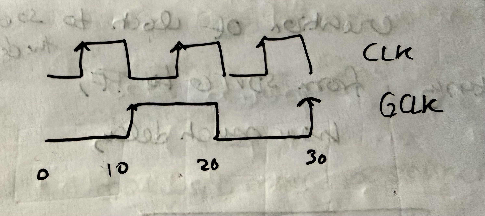
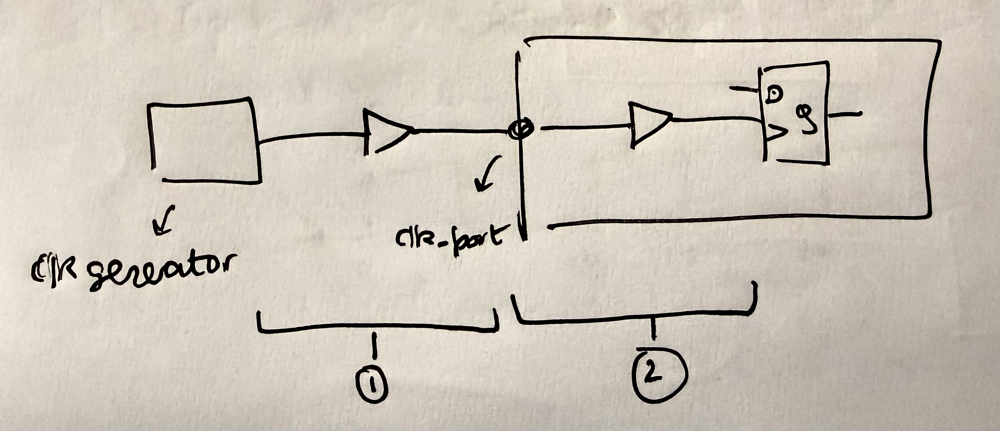

# Synopsis Design Constraints

## create_clock

* Defines primary clock source

``` 
create_clock -name EXT_CLK
             -period 10 
             -waveform {0 4}
             [get_ports clk_in]
```

* The values passed as a tuple to the waveform argument are the times
  when clock edge occurs
* So, for this example, the clock does not have 50% duty cycle


## create_generated_clock

* Defines derived clock source

```
create_clock -name CLK 
             -period 10 
             [get_pins CS1/clk]

create_generated_clock -name GCLK 
                       -divide_by 2 
                       -source [get_pins CS1/CLK] 
                       [get_pins CS2/GCLK]
```



## set_clock_latency

* Types
  1. Source Latency: Delay between the point of creation of clock to clock source in the design
  2. Network Latency: Delay between the clock source of the design to the flip flop

```
create_clock -name CLK 
             -period 200
             [get_ports clk_port]
             
set_clock_latency 5 -source [get_clocks CLK]
set_clock_latency 10 [get_clocks CLK]
```



## set_clock_uncertainity
* Kind of like error margin
* Unpredicted deviation of clock edges from the ideal value
* Used to model:
  * Jitter (temporal variation)
  * Skew (spatial variation)

```
create_clock -name CLK 
             -period 200 
             [get_ports clk_port]
             
set_clock_uncertainity 15
                       -hold
                       [get_clocks CLK]
                       
set_clock_uncertainity 20
                       -setup
                       [get_clocks CLK]
```

* Tool assumes sign of uncertainty based on whether the flip flop is capturing FF or launching FF
* Makes analysis more pessimistic
* For setup: Required_Time = T_period +  T_capture - T_setup - T_uncertainty
* For hold: Required_Time = T_capture + T_hold + T_uncertainty

## set_clock_transition
* Clock Slew
* Crucial for setup time, hold time and Clk-Q delay

```
create_clock -name CLK 
             -period 2000 
             [get_ports clk_port]
             
set_clock_transition 10 [get_clocks CLK]
```

## set_input_delay

## set_input_transition

## set_driving_cell

## set_output_delay
