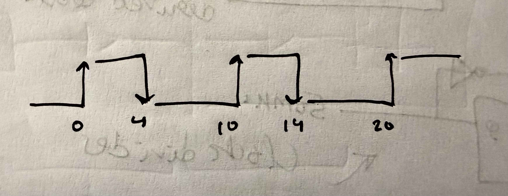

# Synopsis Design Constraints

## create_clock

* Defines primary clock source

``` 
create_clock -name EXT_CLK
             -period 10 
             -waveform {0 4}
             [get_ports clk_in]
```

* The values passed as a tuple to the waveform argument are the times
  when clock edge occurs
* So, for this example, the clock does not have 50% duty cycle


